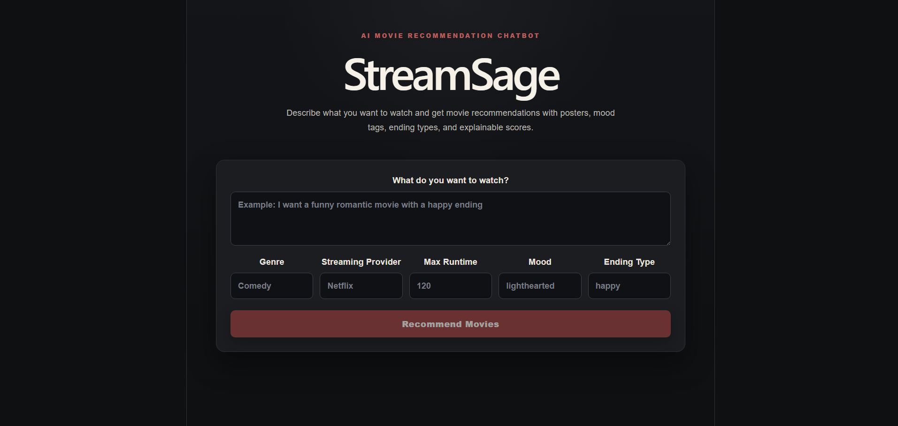
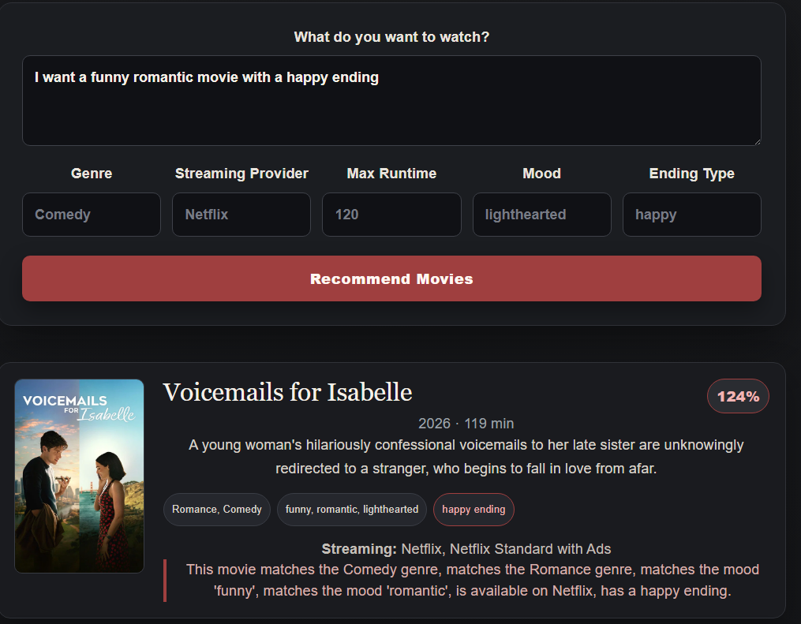

# StreamSage

StreamSage is an AI-powered movie recommendation web app that helps users discover movies based on natural language preferences such as mood, genre, streaming platform, runtime, and ending type.

Instead of only relying on keyword search, StreamSage uses semantic embeddings to understand the meaning behind a user's request and return movie recommendations with posters, metadata, match scores, and explanations.


## Demo

This project is currently designed to run locally due to the memory requirements of the sentence-transformer embedding model. A deployment-safe version is in progress.

Screenshots and setup instructions are included below.

## Project Overview 

Users can enter prompts such as:

```txt
I want a funny romantic movie with a happy ending under 2 hours.
```

StreamSage then returns ranked movie recommendations with:

- Movie posters
- Titles and overviews
- Genres
- Runtime
- Release year
- Streaming providers
- Mood tags
- Ending type
- Recommendation score
- Explanation for why each movie matched


## Features
- Natural language movie search
- React and TypeScript frontend
- FastAPI backend
- SQLite movie database
- TMDB API integration
- Automatic movie seeding from TMDB
- Movie posters and metadata from TMDB
- Mood tagging
- Ending-type tagging
- Sentence-transformer embeddings
- Cosine similarity recommendation search
- Metadata-based reranking
- Prompt parser for extracting genre, mood, runtime, provider, and ending type
- Explainable recommendation scores


## Tech Stack

### Frontend
- React
- TypeScript
- Vite
- CSS

### Backend
- Python
- FastAPI
- SQLAlchemy
- SQLite

### Machine Learning
- Sentence Transformers
- Text embeddings
- Cosine similarity
- Semantic search
- Metadata reranking
- Rule-based prompt parsing

### External API
- TMDB API


## How StreamSage Works

StreamSage uses a hybrid recommendation system.

- First, movie data is collected from TMDB and stored in SQLite. Each movie includes a title, overview, genre, runtime, release year, poster URL, and streaming provider data.

- Next, each movie is enriched with mood tags and ending-type labels. The app then creates a text representation of each movie and converts it into an embedding using a sentence-transformer model.

- When a user enters a prompt, the backend creates an embedding for the prompt and compares it against the stored movie embeddings using cosine similarity. The results are reranked using metadata filters such as genre, mood, runtime, streaming provider, and ending type.


## Backend Setup

### 1. Navigate to the backend folder

```bash
cd backend
```

### 2. Create a virtual environment

Windows:

```bash
python -m venv venv
venv\Scripts\activate
```

Mac/Linux:

```bash
python -m venv venv
source venv/bin/activate
```

### 3. Install backend dependencies

```bash
pip install -r requirements.txt
```

### 4. Create a `.env` file

Inside the `backend` folder, create a file named `.env`.

```env
TMDB_API_KEY=your_tmdb_api_key_here
```

The `.env` file should not be committed to GitHub.

### 5. Seed movie data from TMDB

```bash
python scripts/seed_movies.py
```

### 6. Generate mood and ending tags

```bash
python scripts/tag_movies.py
```

### 7. Generate movie embeddings

```bash
python scripts/generate_embeddings.py
```

### 8. Start the FastAPI backend

```bash
python -m uvicorn app.main:app --reload
```

The backend will run at:

```txt
http://127.0.0.1:8000
```

FastAPI docs:

```txt
http://127.0.0.1:8000/docs
```


## Frontend Setup

### 1. Navigate to the frontend folder

```bash
cd frontend
```

### 2. Install frontend dependencies

```bash
npm install
```

### 3. Create a frontend environment file

Inside the `frontend` folder, create a `.env` file:

```env
VITE_API_BASE_URL=http://127.0.0.1:8000
```

### 4. Start the frontend

```bash
npm run dev
```

The frontend will run at:

```txt
http://localhost:5173
```

---

## Running the Full App Locally

Open two terminals.

### Terminal 1: Backend

```bash
cd backend
venv\Scripts\activate
python -m uvicorn app.main:app --reload
```

### Terminal 2: Frontend

```bash
cd frontend
npm run dev
```

Then open:

```txt
http://localhost:5173
```

---

Example request:

```json
{
  "prompt": "I want a funny romantic movie with a happy ending",
  "genre": null,
  "provider": null,
  "max_runtime": null,
  "mood": null,
  "ending_type": null
}
```

Example response:

```json
[
  {
    "id": 1,
    "tmdb_id": 12345,
    "title": "Example Movie",
    "overview": "Movie overview...",
    "genres": "Comedy, Romance",
    "runtime": 105,
    "release_year": 2004,
    "poster_url": "https://image.tmdb.org/t/p/w500/example.jpg",
    "streaming_providers": "Netflix",
    "mood_tags": "funny, romantic, lighthearted",
    "ending_type": "happy",
    "score": 0.7421,
    "explanation": "This movie matches the Comedy genre, matches the Romance genre, matches the mood 'romantic', and has a happy ending."
  }
]
```


## Screenshots

